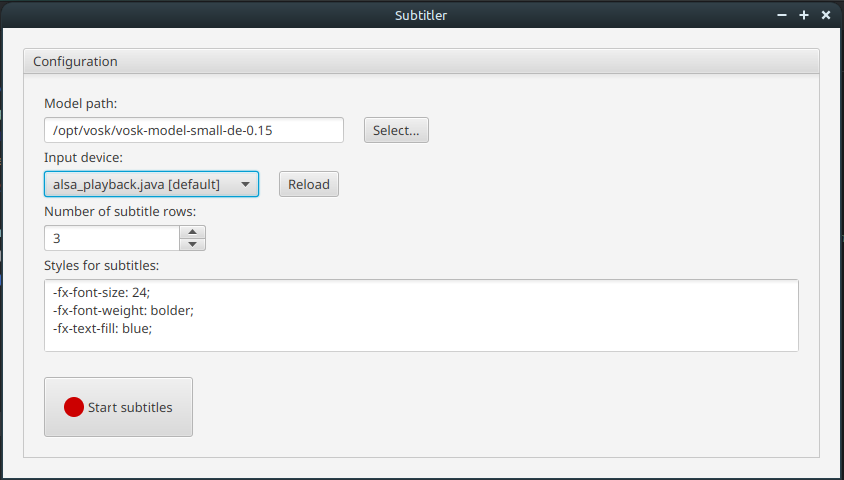

:toc:
:toc-placement!:
:toclevels: 3
= Subtitler

This document describes the _Subtitler_ application hosted in this repository.

toc::[]

== Synopsis
Subtitler is an application that can capture audio from a microphone or another input device and recognize speech. The speech is converted to text in realtime and displayed. This can be used for instance to generate subtitles (hence the name) for speeches or talks. That way such events can be made more inclusive for hearing-impaired people.

The application comes with a minimum UI that allows the configuration of some parameters for speech recognition and how to display the subtitles. When audio capturing is active, the application shows the recognized text according to the configured display settings.

== Technology
The application is written in https://www.scala-lang.org/[Scala]. Since Scala runs on the https://www.java.com/[Java platform], execution is possible on every operating system for which a Java virtual machine is available. The UI is built using https://openjfx.io/[JavaFX].

For speech recognition, the application uses the https://github.com/alphacep/vosk-api[Vosk speech recognition toolkit]. Vosk provides models for different languages and with different levels of quality. There are small models that can be used on devices with limited capacity, and big ones requiring more resources. Subtitler does not ship with any model, but users have to download the model suitable for their use cases from the https://alphacephei.com/vosk/models[Vosk site]. See <<sec_configuration>> for more details.

[#sec_configuration]
== Configuration
The application's configuration defines the parameters for capturing audio data. In addition, it contains properties that determine how subtitles should be displayed in the UI. Typically, users can edit the configuration options in the UI (refer to section <<ui_config_view>>). When the application shuts down, it stores the properties in a file named `.subtitler.json` in the current user's home directory. On the next restart, it loads the file again, so that the latest settings are directly active. It is, of course, also possible to edit this file manually. If the application on startup does not find a configuration file or fails to parse it, it sets all properties to default values.

A sample configuration file containing all supported properties can look as follows:

.Sample configuration file
[source,json]
----
{
  "bounds": {
    "height": 837.0,
    "width": 1568.0,
    "x": 182.0,
    "y": 67.0
  },
  "inputDevice": "J360 [plughw:1,0]",
  "modelPath": "/opt/vosk/vosk-model-small-de-0.15",
  "subtitleCount": 3,
  "subtitleStyles": "-fx-font-size: 24;\n-fx-font-weight: bolder;\n-fx-text-fill: blue;"
}
----

All properties are optional; for missing settings, the application again falls back to default values. Table <<tab_config_properties>> lists the supported configuration properties with a detailed description.

[#tab_config_properties]
.Supported configuration properties
[cols="1,3,1",options="header"]
|====
|Property
|Description
|Default

|inputDevice
|This property determines the input device for capturing audio. This should be a microphone to record speech. The value must be the name of an audio device recognized by Java. In Java terminology, such devices are called _mixers_, and the application selects the device by iterating over all mixers known to the system and matching by the name provided here. Since these names are not easy to guess and the matching is done in an exact and case-sensitive way, it is recommended to enter this value in the UI, which has a select box with all existing mixer names. This property must be specified before the speech recognition process can start.
|empty

|modelPath
|This property points to the folder on the local file system containing the data of the Vosk model to be used for speech recognition. From the https://alphacephei.com/vosk/models[Vosk model site], users can download the desired model in archived form. The archive has to be deflated into an arbitrary folder; this root folder of the model is then the expected value of the `modelPath` property. The value must be defined before the speech recognition process can start.
|empty

|subtitleCount
|This integer property controls the number of subtitles visible in the UI. The generation of subtitles happens chunk-wise in the background. This is done by Vosk, and out of control of this application. Vosk typically issues a new text block when there is a short break in the incoming speech data or when reaching a certain threshold of data; this is considered a _subtitle_. The UI now shows the configured number of subtitles. New subtitles are added at the bottom. When there are more subtitles than specified by the `subtitleCount` property, the oldest ones from the top are removed.
|1

|subtitleStyles
|Using this property, it is possible to style the subtitles displayed in the UI graphically. This is especially useful if the recognized text should be shown to a larger target audience. The value of this property must be a valid CSS declaration that can be interpreted by JavaFX, as the UI uses a JavaFX _text area_ to show subtitles. Refer to the https://docs.oracle.com/javafx/2/api/javafx/scene/doc-files/cssref.html[JavaFX CSS Reference Guide] for details about the available CSS properties. (Note that the text area control does not support all properties listed on this page. Of special interest are probably properties related to https://docs.oracle.com/javafx/2/api/javafx/scene/doc-files/cssref.html#typefont[font styles].) If unspecified, the UI falls back to default JavaFX text styles.
|empty

|bounds
|This property stores an object with the coordinates of the Subtitler main window on the screen. Having this data stored in the configuration can make sense to ensure that the configuration for the subtitles (the font styles and number of subtitles) is compatible with the size of the window. For instance, the window can be carefully positioned and sized, so that the subtitles typically fill it out completely. The property consists of the sub properties `x`, `y`, `width`, and `height` for the corresponding coordinates. Note that if the `bounds` property is specified, all four sub properties must be present.
|(0, 0, 640, 480)
|====

== UI Description
The Subtitler UI is kept quite minimalistic. It basically consists of two views, the <<ui_config_view>>, and the subtitles view. Well, actually, there is a third view to show an error message if something goes wrong during audio processing - which is typically caused by incorrect configuration settings. But this view is rather trivial.

[#ui_config_view]
=== Config View
This view is directly visible after application startup. It allows entering the configuration settings required for audio capturing. Also, the layout of the subtitles view can partially be configured. Figure <<img_config_view>> shows a screenshot of this view.

[#img_config_view]
.Config view

Table <<tab_config_input>> lists the input fields on the view and describes their meaning. Please refer to <<sec_configuration>> for a detailed description of the underlying configuration properties.

[#tab_config_input]
.Input fields of the Config view
[cols="1,3",options="header"]
|====
|Field
|Description

|Model path
|This field expects the path to the Vosk model on the local disc to be used for speech recognition. It corresponds to the `modelPath` configuration property. The _Select_ button opens a directory chooser dialog that allows a convenient selection of the directory containing the model data. Users can download multiple models for different languages or usage scenarios. With this field, a switch to another model is easily possible.

|Input device
|Here, the device to capture audio from can be selected. The combo box shows the audio devices available on the local machine. Note that these devices are obtained via the _get mixer info_ API from the Java Sound system. Unfortunately, Java returns only rather cryptic names here. So, some experiments may be necessary to identify the desired device. This input field corresponds to the `inputDevice` configuration property.

|Number of subtitle rows
|This field allows specifying the number of subtitles shown on the subtitles view. It is backed by `subtitlesCount` configuration property.

|Styles for subtitles
|This text area allows entering the CSS information to style the <<ui_subtitle_view>>. The information comes from and is stored to the `subtitleStyles` configuration property.
|====

At the bottom of the view, there is the _Start subtitles_ button. It becomes enabled if all mandatory properties (i.e. the model path and the input device) are filled. Clicking the button then starts capturing audio from the selected input device and switches to the <<ui_subtitle_view>>.

[#ui_subtitle_view]
=== Subtitle View
The Subtitle view is visible as long as audio processing and speech recognition are running. It shows the results from the recognition component as soon as they become available, up to the configured number of subtitles. Figure <<img_subtitle_view>> shows a screenshot.

[#img_subtitle_view]
.Subtitle view

Since this view is mainly visual, there is not much to say about it. The only interactive element is the _Stop_ button which aborts audio capturing and speech recognition. If pressed, the UI shows again the <<ui_config_view>>.

New subtitles appear after a short delay, typically in phases of short silence in the incoming audio stream. In long phases of silence, there are no changes, and the view keeps showing the last words that were recognized.

Note that the text shown here is the direct output from the Vosk model, without any post-processing. An insufficient recognition quality may indicate that the model needs further fine-tuning, see https://alphacephei.com/vosk/adaptation[Adaptation]. Also, there are currently no punctuation or capital letters in the output.
